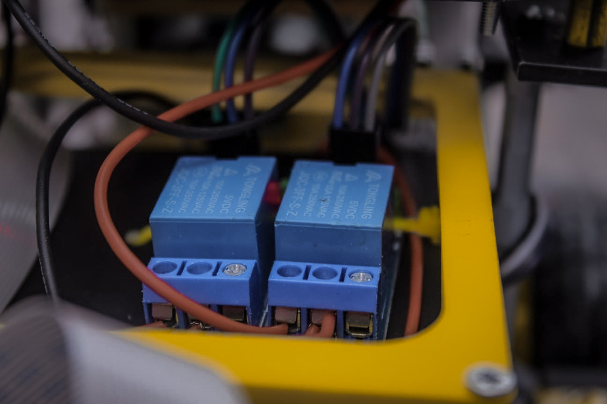

# Rusty

Rusty is a robot that can be used in urgent situations. It is a robot that is meant to be used in places where people can't come and where people can't act.

### Video
- [Camera test](https://youtu.be/8HXwszpL0cw)
- [Face detection test](https://youtu.be/t5X_GBtIJ6A)
- [Relays](https://youtu.be/dtjQ7I3giog)

### About the code
It is using Python 3 for all the code. As computer vision comes with this version of Rusty, I had used the OpenCV library for the AI.

### Features 
- 4 motors -- that can help Rusty moving
- temperature and humidity sensors -- which print information from the sensors
- 2 ultrasonic sensors -- which detect if Rusty comes to close to another object and stops him from having damage
- a solar pannel -- it can be used during sunny days to power Rusty

Rusty represents a continuous development during the last 3 years. Always developed pushing any limit of my knowledge. Created with love and passion.

### Thanks

Special thanks to everyone who was by my side during the last years. To all the events that I had attended along with my buddy Rusty.

This project is dedicated to everyone who dreams the impossible and for all the children that are like the 13 years old version of me back in the time. 

<3
